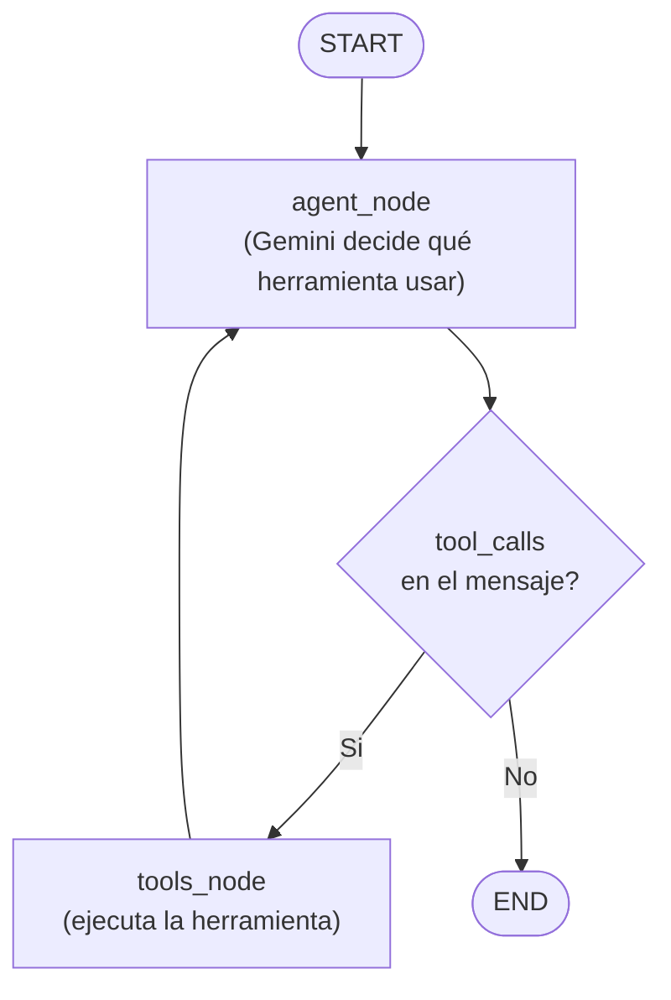
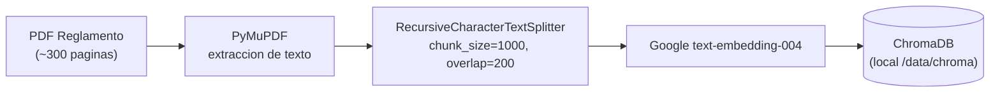
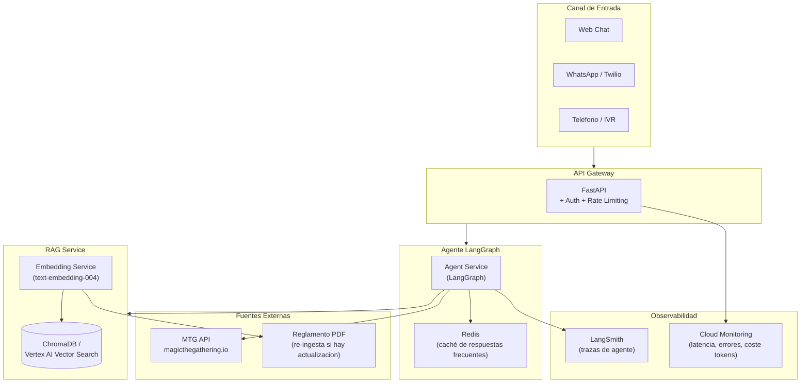

# Arquitectura Chatbot Magic the Gathering

## Stack Tecnologico

- **LLM + Embeddings**: Google Gemini 2.0 Flash + `text-embedding-004` (via `langchain-google-genai`, free tier)
- **Orquestacion**: LangGraph (grafo de estados explícito)
- **Vector DB**: ChromaDB (local, persistente en disco)
- **PDF Parsing**: PyMuPDF (`fitz`)
- **MTG API**: `https://api.magicthegathering.io/v1/` (sin autenticacion)
- **UI Demo**: Streamlit
- **Gestion de entorno**: UV (`pyproject.toml` + `uv.lock`)
- **Bonus**: Imagen de carta custom via `Pillow` + generacion de texto estructurado

---

## Estructura de Carpetas

```
prueba-turing/
├── data/
│   └── MagicCompRules 20260417.pdf
├── src/
│   ├── ingestion/
│   │   ├── pdf_parser.py        # carga y chunking del PDF
│   │   └── vectorstore.py       # inicializa y persiste ChromaDB
│   ├── tools/
│   │   ├── rules_tool.py        # RAG search sobre el reglamento
│   │   ├── card_search_tool.py  # busqueda en MTG API por filtros
│   │   └── card_image_tool.py   # obtiene imagen de carta (bonus: crea custom)
│   ├── agent/
│   │   ├── state.py             # AgentState TypedDict
│   │   ├── graph.py             # definicion del grafo LangGraph
│   │   └── prompts.py           # system prompt del agente
│   └── app.py                   # UI Streamlit
├── tests/
│   ├── test_tools.py
│   └── test_agent.py
├── decisions.md
├── code_review.md
├── README.md
├── pyproject.toml       # dependencias gestionadas con UV
└── uv.lock
```

---

## Flujo del Agente (LangGraph)



El **estado** del grafo es minimalista:

```python
# src/agent/state.py
from typing import Annotated
from langgraph.graph.message import add_messages
from typing_extensions import TypedDict

class AgentState(TypedDict):
    messages: Annotated[list, add_messages]
```

`add_messages` actúa como reducer: cada ciclo acumula mensajes sin sobreescribir el historial, lo que da memoria conversacional nativa.

---

## Las 4 Herramientas (Tools)

| Tool | Entrada | Fuente | Cubre requisito |
|---|---|---|---|
| `search_rules` | `query: str` | ChromaDB (PDF) | Reglas basicas + interacciones |
| `search_cards` | `color, type, cmc_max, name` | MTG API `/cards` | Busqueda por descripcion |
| `get_card_image` | `card_name: str` | MTG API `/cards?name=` | Imagen de carta |
| `create_custom_card` *(bonus)* | `description: str` | LLM (structured output) + Pillow | Cartas custom |

---

## Pipeline de Ingestion (offline, una sola vez)



Criterios de chunking: overlap de 200 tokens para no partir reglas a mitad. Metadatos por chunk: numero de pagina y sección (extraida del encabezado del párrafo).

---

## Tool: `search_rules`

Hace retrieval sobre ChromaDB con el query del usuario + **reranking por relevancia**.  
Devuelve los top-5 chunks con la sección de origen para que el agente pueda citar la fuente.

```python
# Firma simplificada
@tool
def search_rules(query: str) -> str:
    """Busca en el reglamento oficial de Magic the Gathering."""
    docs = vectorstore.similarity_search(query, k=5)
    return format_docs_with_source(docs)
```

---

## Tool: `search_cards`

Llama a `https://api.magicthegathering.io/v1/cards` con los filtros que el LLM extrae de la conversacion (color, tipo, coste de mana, texto de habilidad).

```python
@tool
def search_cards(colors: str = "", type: str = "", cmc: int = None, text: str = "") -> str:
    """Busca cartas de Magic segun filtros: color, tipo, coste de mana (cmc), texto."""
    ...
```

El LLM es responsable de mapear la descripcion en lenguaje natural a los parametros correctos.

---

## System Prompt

El system prompt indica al agente:
- Que es un asistente de call center para dudas de Magic the Gathering
- Que **siempre debe citar** la fuente de sus respuestas (sección del reglamento o nombre de carta de la API)
- Que use `search_rules` para dudas de reglas e interacciones
- Que use `search_cards` para busquedas de cartas por caracteristicas
- Que responda en el idioma del usuario

---

## Arquitectura Productiva (para `decisions.md`)



---

## Entregables del Apartado 1

- `src/` — codigo del agente con tests
- `decisions.md` — explica eleccion de LangGraph vs AgentExecutor, ChromaDB vs FAISS, estrategia de chunking, diseno de herramientas
- `README.md` — instrucciones de instalacion con UV, configuracion de `GOOGLE_API_KEY`, ejecucion de ingestion y arranque de Streamlit
