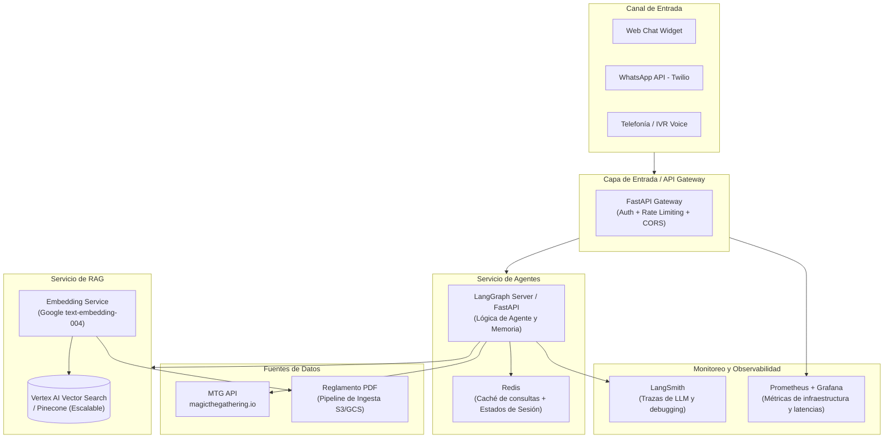

# Documento de Decisiones Técnicas (DDT) - Chatbot MTG

Este documento detalla y justifica las decisiones arquitectónicas tomadas para la solución demo del asistente conversacional de Magic: The Gathering (MTG), así como la propuesta para una arquitectura completa productiva.

---

## 1. Decisiones Arquitectónicas del Prototipo (Demo)

### 1.1 Orquestación: LangGraph vs LangChain AgentExecutor
* **Decisión**: Se ha implementado **LangGraph** para modelar el agente mediante un grafo de estados cíclico.
* **Justificación**:
  - Los agentes tradicionales de caja negra (`AgentExecutor`) suelen entrar en bucles infinitos o llamar a herramientas de forma desordenada en dominios complejos.
  - Para resolver dudas de interacciones en MTG, el agente debe seguir una secuencia estricta: primero extraer nombres de cartas, luego buscar *ambas* cartas en la API, después buscar las reglas asociadas y finalmente responder. 
  - LangGraph permite definir este flujo de control explícito, persistir el estado de la conversación de manera nativa mediante checkpointers (`MemorySaver`) y facilitar la depuración de trazas.

### 1.2 Base de Datos Vectorial: ChromaDB con Embeddings Locales (ONNX)
* **Decisión**: Se ha utilizado **ChromaDB** persistente localmente con embeddings locales **all-MiniLM-L6-v2** a través de ONNX.
* **Justificación**:
  - **Eficiencia de Coste y Límites**: Indexar secuencialmente más de 3,500 reglas individuales en la API de Google Gemini (o cualquier otro proveedor) consume gran parte de la cuota gratuita de embeddings, genera costes y corre el riesgo de suspender la API Key (como ocurrió con la clave proporcionada).
  - **Latencia y Autonomía**: Los embeddings basados en ONNX se ejecutan en local sobre CPU a una velocidad extremadamente alta (~10 ms por búsqueda) y no requieren llamadas a APIs externas ni claves de acceso, garantizando que el sistema de RAG de reglas funcione de manera 100% offline y gratuita.

### 1.3 Segmentación del PDF (Chunking Estratégico)
* **Decisión**: En lugar de usar divisores de caracteres ciegos (`RecursiveCharacterTextSplitter`), se ha implementado un **parseador personalizado** en base a expresiones regulares.
* **Justificación**:
  - El reglamento oficial de MTG está altamente estructurado en secciones jerárquicas (ej. `104.3a`, `104.3b`).
  - Un splitter tradicional rompe las reglas por la mitad o mezcla párrafos inconexos. Nuestro parseador segmenta el texto exactamente en cada inicio de regla numerada y guarda el ID de la regla y la página real como metadatos en ChromaDB. Esto permite al LLM citar de forma exacta la fuente de su razonamiento (ej. "según la regla 105.2a (página 12)...").

### 1.4 API de MTG y Estrategia de Caching
* **Decisión**: Conexión directa con la API oficial sin autenticación y almacenamiento de respuestas en un caché en memoria.
* **Justificación**:
  - La API de MTG (`magicthegathering.io`) puede presentar latencias elevadas o cortes esporádicos.
  - La implementación de un diccionario de caché simple a nivel de módulo en las herramientas evita repetir peticiones HTTP idénticas en la misma sesión, mejorando drásticamente el tiempo de respuesta y evitando el *rate-limiting*.

### 1.5 Reestructuración del Proyecto (Desacoplamiento Raíz)
* **Decisión**: Las utilidades operativas y la interfaz cliente se han sacado de `src/` a la raíz del repositorio:
  - `ingestion/` en la raíz contiene los scripts de indexación de PDF y ChromaDB.
  - `ui/` en la raíz contiene la aplicación cliente web de Streamlit, tratada como un paquete externo e independiente.
  - `src/` contiene única y exclusivamente el backend: el entrypoint de la API REST (`main.py` en FastAPI), la lógica del agente LangGraph (`agent/`) y las herramientas de tarjetas y reglamento (`tools/`).
* **Justificación**:
  - Al separar el cliente web (`ui/`) del servidor de consultas (`src/`), logramos un desacoplamiento de arquitectura clásico (Frontend-Backend).
  - Limpia el código de producción de la API backend de dependencias visuales e independiza la ejecución de scripts manuales (`ingestion/`).

### 1.6 Contenerización con Docker y Docker Compose
* **Decisión**: Creación de un `Dockerfile` optimizado con `uv` y un archivo `docker-compose.yml` que corre la API y la UI en contenedores independientes.
* **Justificación**:
  - **Aislamiento y Portabilidad**: Asegura que cualquier desarrollador pueda arrancar la demo de Streamlit o correr la batería de pruebas en cualquier sistema operativo sin lidiar con diferencias en las versiones de librerías nativas (como PyMuPDF o SQLite para ChromaDB).
  - **Gestión con Volúmenes**: Mapear la base de datos de vectores `.chroma_db` permite ejecutar la ingesta localmente (ahorrando procesamiento en contenedores efímeros) y que el contenedor de la API la lea de forma persistente inmediatamente.
  - **Evitar conflictos de montaje**: No se montan volúmenes en el contenedor de pruebas (`test`) para evitar conflictos de arquitectura (ej. I/O Errors de Windows vs Linux al leer/remover directorios `.venv/` virtuales locales).

---

## 2. Arquitectura de Producción Propuesta

Para escalar este sistema a producción, dar servicio a miles de usuarios concurrentes en múltiples canales (WhatsApp, Web, Teléfono) y garantizar fiabilidad, se propone la siguiente arquitectura:

### Componentes de Producción Explicados:
1. **API Gateway (FastAPI / Kong)**: Gestiona la autenticación de usuarios, enruta peticiones, y controla el número de peticiones por minuto (*rate-limiting*) para evitar costes excesivos en LLM.
2. **LangGraph Graph Service**: Desplegado de forma independiente en contenedores (ej. Kubernetes o ECS). Utiliza Redis para almacenar el estado de la sesión de chat y provee endpoints de streaming para las respuestas del bot.
3. **Redis**: Funciona como base de datos en memoria para almacenar las conversaciones de los usuarios de forma segura y veloz, además de cachear respuestas de la API de MTG y preguntas frecuentes del call center.
4. **Vertex AI Vector Search / Pinecone**: Reemplaza al ChromaDB local de archivo por una base de datos de vectores en la nube gestionada, distribuida y con alta disponibilidad, optimizada para búsquedas rápidas con millones de vectores.
5. **Observabilidad (LangSmith + Prometheus + Grafana)**:
   - **LangSmith**: Esencial en producción para evaluar el comportamiento del agente, analizar qué herramientas está llamando y dónde se producen fallos de lógica.
   - **Prometheus/Grafana**: Monitorea las métricas del sistema: latencia de la API, consumo de CPU/Memoria y porcentaje de errores HTTP.
