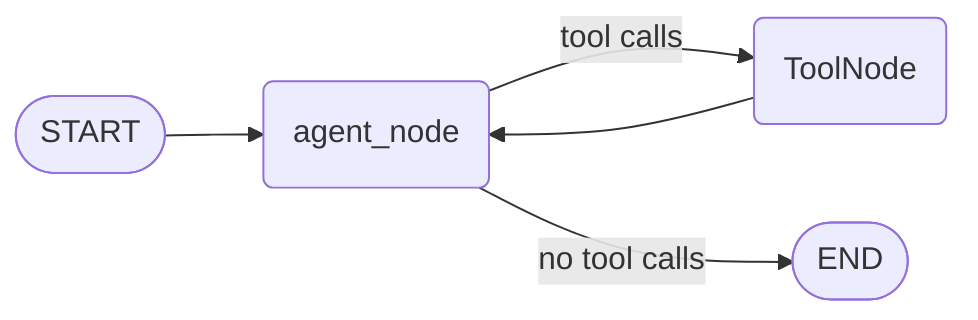
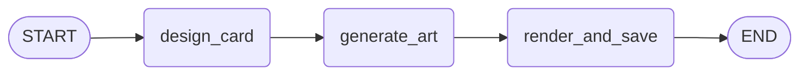
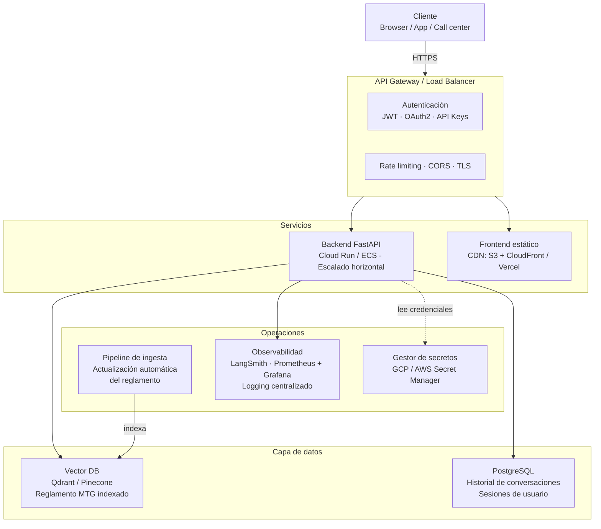

# Documento de Decisiones Técnicas (DDT)

## MTG Chatbot - Prueba Técnica

---

## 1. Visión General

El sistema es un chatbot para un call center de Magic: The Gathering capaz de:

- Resolver dudas de reglas consultando el reglamento oficial (RAG sobre PDF)
- Explicar interacciones entre cartas combinando búsqueda en API y reglas
- Buscar cartas por características mediante la API pública de MTG
- Generar cartas custom con arte generado por IA (bonus)

La arquitectura de demo consiste en un único servicio FastAPI que expone la API del agente y, opcionalmente, sirve un frontend estático.

---

## 2. Decisiones Técnicas

### 2.1 LLM - Gemini 2.5 Flash

**Decisión:** Google Gemini 2.5 Flash como modelo principal.

**Motivos:**

- Créditos de Google Cloud disponibles, lo que eliminaba coste adicional para la demo.
- Familiaridad previa con la API de Google Generative AI.
- Gemini 2.5 Flash ofrece una ventana de contexto amplia y buena velocidad de respuesta, adecuada para un agente con múltiples llamadas a herramientas por turno.

**Alternativas descartadas:** OpenAI GPT-4o, Anthropic Claude. Técnicamente equivalentes para este caso de uso; la elección fue pragmática (acceso y créditos disponibles).

---

### 2.2 Orquestación del Agente - LangGraph

**Decisión:** LangGraph con un grafo ReAct (agente → herramientas → agente) y `MemorySaver` para persistencia en memoria de la conversación.

**Motivos:**

- En la entrevista se me preguntó por LangGraph por lo que supongo que es relevante para el perfil buscado.
- El modelo de grafo de estados permite añadir nodos de forma aislada (p. ej., el subgrafo de creación de cartas custom) sin tocar el flujo principal.
- `MemorySaver` simplifica enormemente la gestión de historial de conversación en una demo sin necesidad de base de datos externa.

**Diseño del agente principal:**

**Subgrafo para cartas custom:**

El agente principal llama a `create_custom_card` como una herramienta más; internamente esa herramienta ejecuta el subgrafo de tres pasos. Esto mantiene la lógica de creación encapsulada y testable de forma independiente.

---

### 2.3 Base de Datos Vectorial - ChromaDB

**Decisión:** ChromaDB en modo local (persistido en disco) para el índice RAG del reglamento.

**Motivos:**

- Permite crear y usar la base de datos vectorial sin levantar ningún servicio externo, lo que simplifica enormemente la puesta en marcha de la demo.
- Integración nativa con LangChain (`langchain-chroma`), sin código de adaptación adicional.
- El reglamento es un documento estático (se actualiza periódicamente, no en tiempo real), por lo que una solución local es suficiente para este contexto.

---

### 2.4 Backend - FastAPI

**Decisión:** FastAPI como framework de backend.

**Motivos:**

- Familiaridad con la tecnología.
- Framework potente.
- Generación automática de documentación OpenAPI, útil para que el equipo evaluador pueda explorar los endpoints.

---

### 2.5 Frontend - SPA Vanilla JS (módulo opcional)

**Decisión:** Frontend como SPA en HTML/CSS/JS puro, servido por el propio FastAPI mediante `StaticFiles`. Su activación se controla con la variable de entorno `SERVE_FRONTEND`.

**Motivos:**

- El backend es el núcleo de la solución; el frontend es un accesorio para facilitar la demo sin necesidad de abrir Swagger.
- Al ser un módulo opcional (configurable en un único punto), el backend funciona de forma completamente independiente: se puede desactivar el frontend y consumir la API desde cualquier cliente sin cambiar nada más.
- Se descartó un framework de frontend (Next.js, React) porque habría desplazado el foco hacia el frontend cuando el valor del reto está en el backend y el agente.
- El diseño permite, en una evolución futura, desacoplar completamente el frontend.

---

### 2.6 Generación de Imágenes - Google Imagen 4

**Decisión:** Google Imagen 4 (`imagen-4.0-fast-generate-001`) para generar el arte de las cartas custom.

**Motivos:**

- Disponible en la misma cuenta de Google Cloud ya utilizada para Gemini, sin necesidad de gestionar credenciales adicionales.
- La funcionalidad de cartas custom es un bonus; la elección del modelo de imagen no es crítica para el reto.

---

### 2.7 Observabilidad - LangSmith

**Decisión:** LangSmith para trazabilidad de las ejecuciones del agente.

**Motivos:**

- Se integra de forma transparente con LangGraph: basta con configurar cuatro variables de entorno para obtener trazas completas de cada ejecución del grafo (nodos visitados, inputs/outputs de cada herramienta, latencias).
- Es opcional y no intrusivo: se activa únicamente si `LANGSMITH_TRACING=true` y se ha proporcionado una API key. Si no se configura, el sistema funciona con normalidad.
- Permite detectar en qué nodo falla el agente, qué herramientas llama y con qué argumentos, sin instrumentación manual.

---

### 2.8 Estrategia de Chunking del PDF

> *Sección pendiente de completar. Se detallará la estrategia de segmentación del reglamento (tamaño de chunk, solapamiento, metadatos por regla) en una revisión futura.*

---

## 3. Arquitectura Productiva Propuesta

La demo actual es un monolito útil para evaluar la solución, pero no es adecuada para producción. A continuación se describe una arquitectura productiva:

### Cambios principales respecto a la demo

| Área               | Demo actual                                 | Producción                                                                     |
| ------------------ | ------------------------------------------- | ------------------------------------------------------------------------------ |
| Frontend           | Servido por FastAPI (`SERVE_FRONTEND=true`) | CDN o aplicación independiente                                                 |
| Historial de conv. | `MemorySaver` (en memoria, volátil)         | PostgreSQL con `AsyncPostgresSaver` de LangGraph                               |
| Vector DB          | ChromaDB local                              | Qdrant o Pinecone (servicio gestionado)                                        |
| Autenticación      | Ninguna                                     | JWT / OAuth2 / API Keys por tenant                                             |
| Escalado           | Un único proceso                            | Réplicas stateless detrás de load balancer                                     |
| Ingesta del PDF    | Manual (script local)                       | Pipeline automático (CI/CD o webhook al publicar nueva versión del reglamento) |
| Secretos           | `.env` local                                | Gestor de secretos (AWS Secrets Manager, GCP Secret Manager)                   |
| Rate limiting      | Ninguno                                     | API Gateway con límites por usuario/tenant                                     |

