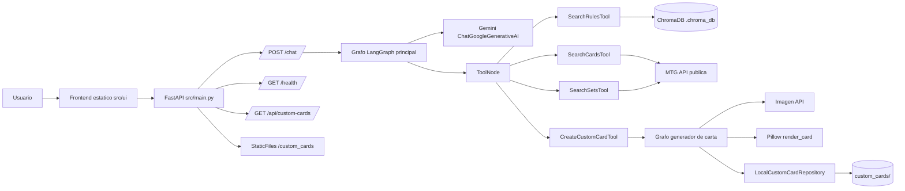
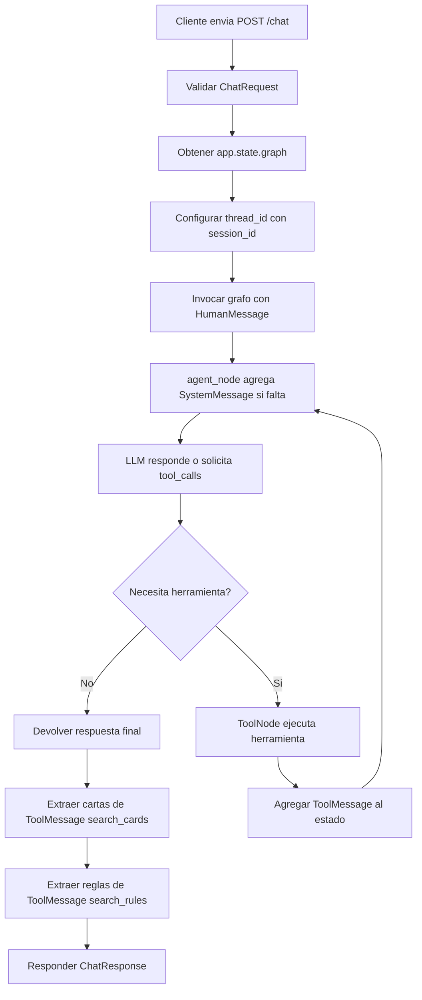
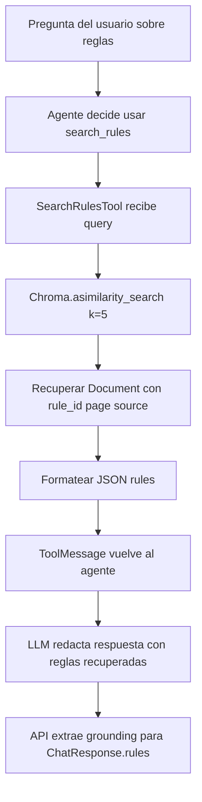
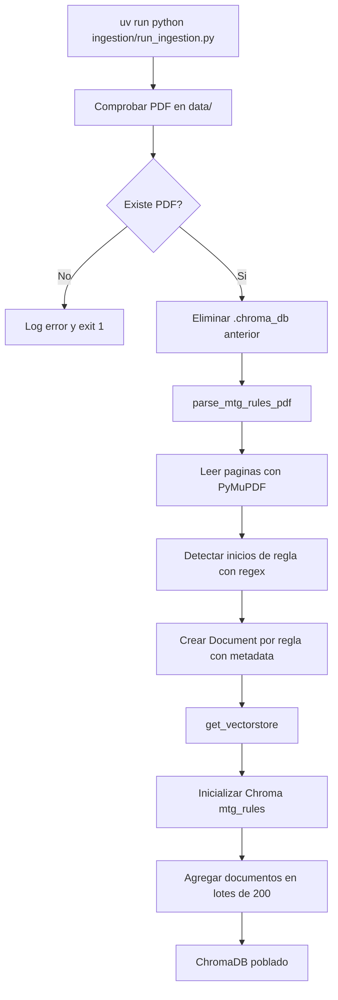
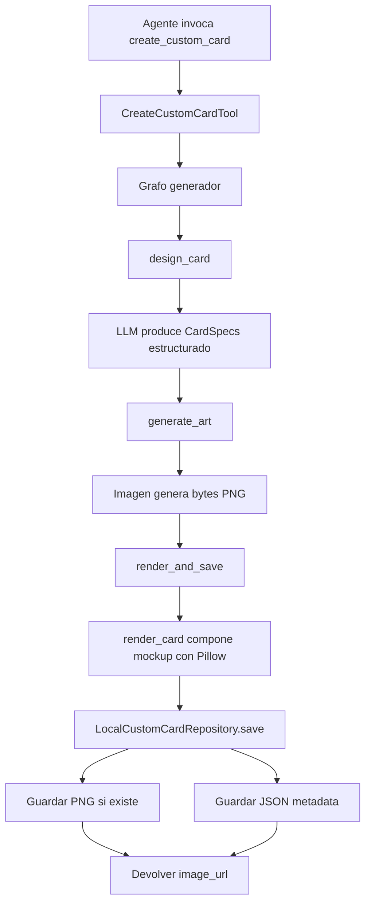

# Diagramas

Los diagramas estan escritos en Mermaid para que puedan renderizarse en GitHub, VS Code u otros visores compatibles.

## Componentes

## Flujo de chat

## Flujo RAG de reglas

## Flujo de ingesta

## Flujo de creacion de carta custom

## Diagrama de clases

```mermaid
classDiagram
    class Settings {
        +str API_URL
        +bool SERVE_FRONTEND
        +str GEMINI_API_KEY
        +str GEMINI_MODEL
        +float GEMINI_TEMPERATURE
        +str CHROMA_DB_PATH
        +str CHROMA_COLLECTION_NAME
        +bool LANGSMITH_TRACING
    }

    class AgentState {
        +list messages
    }

    class ChatRequest {
        +str message
        +str session_id
    }

    class RuleGrounding {
        +str rule_id
        +int page
        +str text
    }

    class ChatResponse {
        +str response
        +list~Card~ cards
        +list~RuleGrounding~ rules
    }

    class Card {
        +str name
        +str mana_cost
        +str type
        +str text
        +str image_url
        +str power
        +str toughness
        +str rarity
        +str flavor
        +list~str~ colors
        +str set
    }

    class MTGCard {
        +str name
        +str manaCost
        +float cmc
        +list~str~ colors
        +str type
        +str rarity
        +str text
        +str imageUrl
    }

    class ICardSearch {
        <<Protocol>>
        +search_cards(...) list~MTGCard~
    }

    class ISetSearch {
        <<Protocol>>
        +search_sets(...) list~dict~
    }

    class MTGClient {
        -AsyncClient _client
        +search_cards(...) list~MTGCard~
        +search_sets(...) list~dict~
    }

    class ImageGenerationClient {
        <<Protocol>>
        +generate(prompt) bytes
    }

    class ImagenGenerationClient {
        -Client _client
        +generate(prompt) bytes
    }

    class CustomCardRepository {
        <<Protocol>>
        +save(card_specs, image_bytes) Card
        +find_all() list~Card~
    }

    class LocalCustomCardRepository {
        -str _base_dir
        +save(card_specs, image_bytes) Card
        +find_all() list~Card~
    }

    class SearchRulesTool {
        +str name
        +str description
        -Any _vectorstore
        +_arun(query) str
    }

    class SearchCardsTool {
        +str name
        +str description
        -ICardSearch _client
        +_arun(...) tuple
    }

    class SearchSetsTool {
        +str name
        +str description
        -ISetSearch _client
        +_arun(...) str
    }

    class CreateCustomCardTool {
        +str name
        +str description
        -Any _graph
        +_run(description) str
        +_arun(description) str
    }

    class CardSpecs {
        +str name
        +str mana_cost
        +list~str~ colors
        +str type_line
        +str rules_text
        +str flavor_text
        +str art_prompt
        +str power
        +str toughness
    }

    class CardGeneratorState {
        +str description
        +dict card_specs
        +bytes art_bytes
        +str card_path
    }

    MTGClient ..|> ICardSearch
    MTGClient ..|> ISetSearch
    ImagenGenerationClient ..|> ImageGenerationClient
    LocalCustomCardRepository ..|> CustomCardRepository

    SearchCardsTool --> ICardSearch
    SearchSetsTool --> ISetSearch
    SearchRulesTool --> Chroma
    CreateCustomCardTool --> ImageGenerationClient
    CreateCustomCardTool --> CustomCardRepository
    CreateCustomCardTool --> CardSpecs
    LocalCustomCardRepository --> Card
    ChatResponse --> Card
    ChatResponse --> RuleGrounding
```

