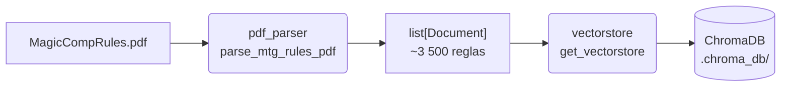

# Pipeline de Ingesta

Procesa el PDF del reglamento oficial de Magic: The Gathering y lo indexa en ChromaDB para que el agente pueda hacer búsquedas semánticas sobre él.

## Flujo



## Pasos

### 1. Limpieza (`run_ingestion.py`)

Si ya existe un directorio `.chroma_db` se elimina antes de empezar. La ingesta siempre parte de cero para evitar duplicados al re-ejecutar.

### 2. Parseo del PDF (`pdf_parser.py`)

El PDF se abre con **PyMuPDF** (`fitz`). El texto se extrae página a página y se segmenta en reglas individuales usando la siguiente expresión regular:

```
^\d{3}\.\d+[a-z]?\.?   →  regla concreta,  e.g. "100.1", "100.1a"
^\d{3}\.                →  sección,          e.g. "100."
^\d\.                   →  capítulo,         e.g. "1."
```

Cada vez que se detecta el inicio de una regla nueva se guarda la regla anterior como un objeto `Document` de LangChain con los metadatos:

| Campo | Contenido |
|---|---|
| `rule_id` | Identificador de la regla (`"100.1"`, `"1"`, …) |
| `page` | Número de página en el PDF (1-indexed) |
| `source` | Ruta al PDF |

**Chunk = regla individual.** No se usa un splitter de tamaño fijo; el límite natural de cada regla del reglamento es el chunk. Esto permite que el agente cite el número de regla exacto en sus respuestas.

### 3. Indexación en ChromaDB (`vectorstore.py`)

Los documentos se añaden a ChromaDB en lotes de 200 para evitar timeouts. ChromaDB usa por defecto el modelo local **ONNX all-MiniLM-L6-v2** para generar los embeddings, lo que significa que no se necesita ninguna API key externa en este paso.

La base de datos se persiste en disco en la ruta configurada (`CHROMA_DB_PATH`, por defecto `./.chroma_db`).

## Configuración

Los parámetros de la pipeline se leen desde `Settings` (`.env`):

| Variable | Por defecto | Descripción |
|---|---|---|
| `CHROMA_DB_PATH` | `./.chroma_db` | Directorio donde se persiste ChromaDB |
| `CHROMA_COLLECTION_NAME` | `mtg_rules` | Nombre de la colección |

La ruta al PDF es fija: `data/MagicCompRules 20260417.pdf`.

## Ejecución

```bash
# Manual (desde la raíz del proyecto)
uv run python -m ingestion.run_ingestion

# Automática (durante el build de Docker)
# El Dockerfile incluye este paso; la base de datos queda dentro de la imagen.
```

## Uso en el agente

En el arranque de la aplicación (`src/main.py`), el agente lee la base de datos ya indexada:

```python
vectorstore = Chroma(
    collection_name=settings.CHROMA_COLLECTION_NAME,
    persist_directory=settings.CHROMA_DB_PATH,
)
```

La herramienta `search_rules` ejecuta `vectorstore.asimilarity_search(query, k=5)` para recuperar las 5 reglas más relevantes a cada pregunta y devolverlas al agente con su `rule_id` y número de página.
